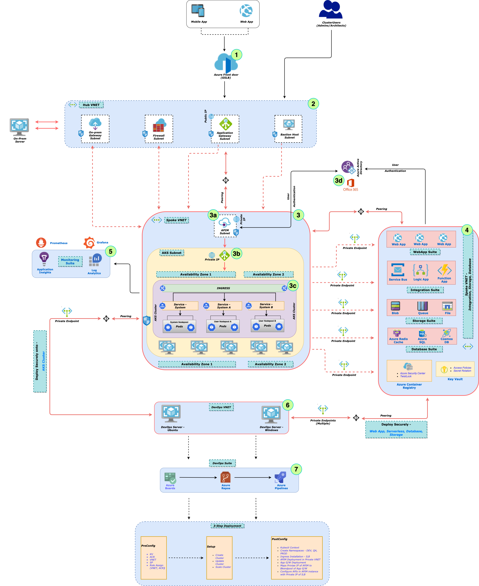

# 				AKS - Anatomy of Deployment





## Prelude

Creation of AKS cluster is quite different from traditional PaaS services deployment. It is NOT only the cluster that one should be considering; there are other surrounding services (*read Infrastructure services*) that also should be taken into account, while planning for AKS cluster.

Actually these services around AKS cluster are more important and critical to manage for the proper functioning of the cluster; and also following all the best practices.

The primary things that we need to consider during AKS deployment are - 

- **Infrastructure Management** - Nodes, Managed Disks, VNETs, Subnets, DNS Zones, LoadBalancers etc.

- **Authentication/Authorization**  - AAD integration, RBAC thru AAD

- **Monitoring** - Integration with *Azure Monitor* as well as open source counterparts like *Prometheus, Grafana*

- **Storage Management** - *Storage* Classes (*azureFile, azureDisk*), *Persistent Volumes*

- **Security** - 

  - *Network Policy* - How Applications/Pods would communicate between each other; ensuring last access policy for Pods
  - *Egress Policy* - How Applications/Pods would 
  - *Private Endpoint* - Connectivity with other Azure services like *Azure Storage, Azure KeyVault, Azure SQL, CosmosDB* etc.

  ......and More

Let us divide the entire set of activities into 3 broad categories -

- **Day-0**: Planning Phase
- **Day-1**: Execution and Hardening Phase
- **Day-2**: Deployment Phase

## Day-0 Activities - Planning Phase

### Plan User/Group management

This is to ensure a proper RBAC is implemented providing restricted access to various components within the AKS cluster.

- At least 3 Primary roles to be considered - *Cluster Admi*n, *Architects*/*Managers* and *Developers*. Based on requirement more cna be thought of

- These groups would be added as an Azure AD group with clear segregation of responsibilities. These groups would be mapped onto AKS cluster post creation of the cluster process -

  - **All** access to *Cluster Admins*

  - **Less** Access to *Architects* but enough to manage the entire cluster operation - *Deployment, Monitoring, Troubleshooting, Security* etc.

  - **Least** access to *Developers* - Primarily to allow them to deploy using Code changes and CI/CD; but provide the amount of access to perform basic application management like *Pods, Deployments, Services* etc.

  - Actual *Role Assignment* and *Role Bindings* would happen on **Day-1**

    

### Plan Network topology

- **Hub-n-Spoke Or Dedicated**

  Preferred is *Hub-n-Spoke* as it makes entire topology flexible

  In both the cases decide on the list of VNETs and Subnets to used (Existing or New). At the minimum following is the list that are needed -

  **VNETs** - 

  - **Hub VNET** - Contains Subnets that are used across multiple resources, clusters or services e.g.
    
    - **Application Gateway Subnet** - **/27** should be a good choice for Dev/UAT and Prod both
      - Select **Standard_V2** at least and **WAF_V2** if WAF service is needed as well
      - Used as external LoadBalancer, performs SSL Offloading (*optional*), maintains a backend pool of Private IPs - e.g. Private IP of Nginx Ingress controller. This way communication remains secure yet flexible
    - **Bastion Host Subnet** - **/29** should be a good choice for Dev/UAT and Prod both
      - Primarily used for connecting to Private resources within the Architecture e.g. Private ARO cluster
      - Should have all necessary s/w to be installed viz. 
        - *Docker*
        - *Kubectl*
        - *Azure CLI*
        - *Helm*
        - *Git, Any GitHub Client*
        - *PowerShell Core*
        - *VS Code IDE and associated plugins - azure, git, PowerShell*
    - **Firewall Subnet** *(Optional) -* https://docs.microsoft.com/en-us/azure/firewall/features 
- **Gateway Subnet** (*Optional*) -  For On-Prem Connectivity over *site-to-site* or *point-to-site*
    
  - **AKS+ VNET** - **/20** for *Dev* and /**18** for *Prod* at least
  
  - **AKS subnet** - A completely dedicated Subnet for AKS cluster. No other resources to be planned on this. 
  
    **<u>/21, 22</u>** for Dev/UAT and **<u>/18, /20</u>** for Prod id safe to choose. *If Address space is an issue then Kubenet*. This should be a dedicated subnet for AKS cluster.
  
    The question that should debated at this stage are -
    
      - How many micro-services approximately to be deployed (*now* and *in future*)
      - What would the minimum and maximum no. of replicas for each
      - How much *CPU* and *Memory* that each micro-services could consume approximately
      - And based on all these –
        - What is Size of each *Node* (VM) i.e how many *Cores of CPU* and how much *GB of Runtime Memory*
      - how many *Nodes* (VMs) that the cluster could expect (*initially and when scaled up?*) – basically *minimum* and *maximum* no. of such *Nodes*
    - Finally *maximum* number of pods or app replicas you want in each *Node* – Ideally whatever be the size of the *Node*, this value should not go beyond 40-50; not an hard and fast rule but with standard VM sizes like 8 Core 16 GB, 40-50 *Pods* per *Node* is good enough Based on all these info, let us try to define a formulae to decide what would be the address space of VNET and Subnet for AKS.
  
    Let us assume,
  
    **Np** = Max. Number of Pods in each Node (Ideally should not be more ethan 40-50)
  
    **Nd** = Max. Number of Nodes possible (approx.)
  
    Then the total no. of addresses that you would need in AKS Subnet = **(Np \* (Nd + 1) + Np)**
  
    *+1 for reserved IP by system for each Node*
  
    *+Np for additional IPs you might need while Upgrade* – normally K8s system will pull down one Node at a time, transfer all workloads to another Node and then upgrade the previous Node
  
    It is advisable to keep some more in buffer based on workloads and other unforeseen situations
  
    What we have seen, for high end workloads, ideally for a *DEV-UAT* cluster, we should go with **/21 or /22** which means around 2k or 1k *Nodes*.
  
    *PROD* cluster should have a bit more like **/18 or /20** which means around 16k or 4k *Nodes*.
  
  - **APIM subnet** (*Optional*) - One dedicated subnet for APIM. Two options are there - *External VNET* or *Internal VNET*.
  
    - *Same VNET or Separate VNET*? If one APIM across entire org then should be in a separate VNET and then peering with ARO VNET
  
    - *Address Space* - **/29** is enough for both DEV and PROD
  
  - **Integration Services VNET** - Provide Private endpoint for these all integration services peered with *ARO VNET* viz.

    - *Azure Container Registry aka ACR*

    - *Azure KeyVault*

    - *Storage*

    - *Azure SQL DB*

    - *Azure Redis Cache*

    - *Cosmos DB*

    - *Azure Service Bus*

  - **DevOps VNET** - Self-hosted DevOps agents - *Linux* or *Windows*
  
  - **NSGs** to be decided Upfront
    
    - Decide basic NSGs for all the subnets
    - Some important *Inbound* rules to be followed -
      - App G/W allows communication only from Azure Front door
      - APIM should accept traffic only from App G/W
      - AKS subnet should accept traffic only from APIM and/or On-Prem VNET gateway
    - Some important *Outbound* rules to be followed -
      - AKS Subnet outbound would always use the public *Standard LoadBalancer* created during Cluster creation process. To change that behaviour - add appripriate outbound rules and anyone of the following
        - NAT Gateway associated with AKS subnet
        - UDR through a Firewall Subnet
        - Forcing communication directly through web corporate proxy - this needs some amount scripting. Setting *http_proxy* or *https_proxy* can be deployed as a *Daemonset* on every AKS cluster node and force Nodes to send raffic through proxy

### Plan Communication to Azure Services

- **Private/Service Endpoints**

  Plan to use  for *Private Endpoints* (Or at least *Service Endpoints*) wherever possible for communication with Azure resources 	like Storage, SQL, CosmosDB etc. This makes communication secure and fast

  

- **Service Principal or AAD Pod Identity**

  - Service Principal with limited access to variopus Azure resources. This make sure any communication from within tthe PODs are all secured and legitimate within Azure

    

- **Service Principal for AKS cluster**

  - Allowing access to AKS subnet and various other azure resources; create Service Principal and Define roles to itt and assign it to designated azure resource(s) like VNET etc. Role should be as per the requirement and follow least access principal
  - Actual creation would happen on **Day-1**

### Plan DevOps setup

- *Self Hosted agent* - This ideally should be Ubuntu machine with at least 2 Core 8 GB spec (Or Windows machine with similar configuration)
- Same agent machine can be used both as *Build Agent* and *Deployment Agent*
- The VNET (as described aloe) should be peered with *AKS VNET*
- *Integration Services VNET* should be peered with *DevOps VNET*. This is to make sure that CI/CD pipeline can deploy these resources (*ACR, Key Vault, Service Bus, Storage, PaaS Databases etc.*)

### Plan ACR setup

- Ideally two ACRs - one for *DEV* and one for *PROD*
- Private Endpoint support
- DevOps VNET should be able to access the ACR Subnet
- No Admin access enabled; Service principal to be used for accessing it from within the cluster as well as DevOps pipeline(s)

### Plan KeyVault setup

- Ideally One KeyVault - Managing the keys from different apps and environments with varying access

- Private Endpoint support

- DevOps VNET should be able to access the KeyVault Subnet. During CI/CD process all keys are downloaded from *KeyVault* and mapped to Application variables

  

## Day-1 Activities

### Approach

- 3 Step Approach - *Pre-Provision, Provision, Post-Provision*
- Each step would be sharing one script e.g. *PreConfig.ps1, Setup.ps1, PostConfig.ps1*
- Deployment scripts can be anything as per comfort and choice - preferred is *PowerShell* and *ARM template* combination as that is Native Azure; but Terraform can be another good option with more human-readable scripts.In all the cases, the approach should be to decouple the entire process into 3 steps as described above

### Scripts (ARM template approach)

- **Folder Structure** - 

  - **Deployments**

    - **SetUp** - Contains following PowerShell scripts -

      - ***PreConfig.ps1*** - Sets up all Infra as decided on ***Day-0*** planning

        (*Associated Roles* -  **Cluster Admin**)

        1. Creates Service Principal for AKS cluster
        2. Creates *Service Principal* for ACR 
        3. Deploys entire Network  setup using ARM templates 
        4. Deploys ACR using ARM templates 
        5. Deploys KeyVault using ARM templates 
        6. Saves above two Service Principals into KeyVault for later use
        7. Assigns ***Network Contributor*** role to the AKS *Service Principal* on AKS VNET

        

      - ***Setup.ps1*** - Creates Cluster with all custom parameters

        (*Associated Roles* -  **Cluster Admin**)

        

        1. Creates AKS cluster

        2. Uses AKS Service Principal from above step

        3. Uses AKS VNET and Subnet created in the above step

        4. Defines VM size - 4 Core 16 GB is standard; to be deicded baded on your workload

           (*As explained above in **Day-0** activities*)

        5. Defines Max Nodes count - As explained above in **Day-0** activities

        6. Defines Max Pods count - As explained above in **Day-0** activities. Again reiterating, this should ideally not go beyond *40 - 50 PODs per Node*; for better performance with Service Discovery within the cluster. Having more than that results in serious performance issues

        7. Defines Node set type - this can be *AvailabilitySet* (*aka *AS*) or *VMSS*. *AS* provides - *Fault Domain* and *Update Domain* - so for HA you should go with *AS* support

        8. Users can chose to go for *Availability Zone* (*aka AZ*) support as well (*If the region is included in our supported regions list*)

        9. Enables AddOns like - *Monitoring*, *VIrtual Nodes* etc.

        10. Defines Azure AD credentials (*from **Day-0** activities*). This would be used for RBAC within the cluster

        11. Enables *Cluster AutoScaler* for automatic horizontal Node scaling 

        

      - ***PostConfig.ps1*** - Setup Cluster created above with additional tools and services (*if needed*)

        (*Associated Roles* -  **Cluster Admin**, **Architects**)

        1. Installs Ingress Controller - NGINX is installed by default (using Helm chart) but script can be easily modified to install other such tools. Ingress is deploed as an ILB (*Internal Load Balancer*).

           The Private IP of ILB can be then added as a RecordSet through a Private DNS Zone to get a custom domain name

        2. Deploys APIM which points to the Private IP or Custom Domain name to call backend APIs. APIms hould define a Health service to check backend status and returns some response (*HTTP status codes between 200 - 399*)

        3. Deploys Application Gateway with WAF_V2 support.This can be mdofied to use Standard_V2 tier also.

           Application Gateway would have Private IP of APIM as in the backend pool. The health service as above would be used a Health probe by App G/W to monitor the backend and keep the links alive
           
           

    - **Templates** 

      1. Contains all the ARM templates for - *Virtual Network, ACR, KeyVault, Application Gatewa*y

      2. The Master PowerShell scripts (*as described above*) in the Setup folder would be calling each of these templates and deploy resources 1-by-1

      3. For terraform scripts, this folder can be used for storing terraform templates for each resource

         

    - **YAMLs**

      1. Contains primarily 2 folders - *Cluster Admin, RBAC, Ingress*

      2. **Cluster Admin**

         - Contains scripts for Adding ***Cluster Admin*** group created as part of ***Day-0*** activities
         - Contais scripts for defining *Persisten Volume(s)* (*as discussed in **Day-0** activities*)

      3. **RBAC**

         - Contains RBAC roles and bindings definition for ***Architects*** group created as part of ***Day-0*** activities
         - Contains RBAC roles and bindings definition for ***Developers*** group created as part of ***Day-0*** activities

      4. **Ingress**

         - Contains *Ingress* object as a sample
    - Install One *Ingress* object per NameSpace
         
       - Define *Service Routes* as per requirements
  

  
### Execution
  
**Infrastructure Architects** would execute multiple scripts to -
  
- Setup the Infrastructure around AKS cluster
  
- Create the AKS cluster
  
- Hardening the cluster
  
- Finally handover the cluster to Developer Architects
  
- Scripts ideally can be anyone  of this -
  
  - Bash scripts running Azure CLI commands
  
  - Single ARM template to deploy all resources - *AKS cluster, ACR, Key Vault, Application Gateway* etc.
  
    One drawback with this approach is that, it would be a single point of failure; the script might become very long and difficult to debug or manage
  
  - PowerShell script as the deployment manager and deploying various ARM templates for creating/managing individual  resources viz. *ACR, Key Vault* etc.
  
    This way the resource creation/updates become smaller chunk of ARM template files and with PowerShell any failure/error cane handled easily as well as subsequent changes to the deployment process
  
  
  

  ### Prerequisites

  - All the scripts below should ideally be run on Self-Hosted DevOps machine or any Bastion Host machine used for AKS cluster management

  - Select a suitable machine for initial setting up of the cluster - *Windows* or *Linux*. Refer to the Bastion Host setup described above in *Day-0* section

  - Select a suitable machine for DevOps - *Windows* or *Linux*. Refer to the DevOps setup described above in *Day-0* section

  - Private clusters would block all K8s API server access over public network; hence both Azure CLI would be blocked to access, view, manage cluster resources. If the plan is to create a *Private Cluster* then a designated machine is imperative for day-to-day operation of the cluster

  - **Installation of Tools/Softwares**

    - **Docker** - 

      - Windows - https://docs.docker.com/docker-for-windows/install/
    - Linux - https://runnable.com/docker/install-docker-on-linux
  
    - **Kubectl** - 

      - Windows - https://kubernetes.io/docs/tasks/tools/install-kubectl/#install-kubectl-binary-with-curl-on-windows
    - Linux - https://kubernetes.io/docs/tasks/tools/install-kubectl/#install-kubectl-on-linux
  
    - **Azure CLI** -

      - Windows - https://docs.microsoft.com/en-us/cli/azure/install-azure-cli-windows?tabs=azure-cli
    - Linux - https://docs.microsoft.com/en-us/cli/azure/install-azure-cli-apt#install
  
    - **Helm** -

      - Windows and Linux - https://helm.sh/docs/intro/install/

    - **Git** - 

      - Windows - https://git-scm.com/download/win
    - Linux - https://git-scm.com/book/en/v2/Getting-Started-Installing-Git
  
    - **GitHub Desktop** (*Windows only*) -

      - Windows - https://desktop.github.com/

    - **PowerShell Core** -

      - Windows and Linux - 
      - https://docs.microsoft.com/en-us/powershell/scripting/install/installing-powershell?view=powershell-7.1
  
    - **VS Code IDE** -

      - Windows - https://code.visualstudio.com/

        

  - **Security Keys**

    - The scripts below would communicate with *Azure Resource Manager* before/after deploying individual resources; hence the script(s) has to be login to Azure either thru Azure CLI or PowerShell
  - Since the script can be run from CLI, PowerShell Console Or through DevOps processes - suggested approach is to have a non-interactive login to Azure
    - This can be achieved using Service Principal with appropriate Access control; and the service principal should be also kept securely and used multiple times whenever needed
    - Similarly there would many such information that would shared across various PowerShell steps viz. *SubscriptionId*, *TenantId* and *ObjectId* os the user running the script(s) etc.
    - Also note that, the same scripts would be used across various environments - *DEV, QA, Staging* and *PROD*
    - Recommended Approach - 
      - Create a *Master Key Vault* - by *Infrastructure team*
      - Store the common secrets manually there - e.g. 
        - *SubscriptionId*
        - *TenantId*
        -  *ObjectId*
        - *Service Principal Id* - with super access to the *Subscription*, may be, Or anything suitable as per org policy
        - *Service Principal Secret*
      - Script(s) at runtime would refer to this *Master Key Vault* and use the info to *Login* to Azure
  
  

  ### **Pre-Config Script**

  - Login to the Azure using info from Master Key Vault

  - Create Service Principal for AKS cluster (*to be used later on*) - say, ***AKS-SP***

  - Create Service Principal for accessing Azure Container Registry aka ACR (*to be used later on*) - say, ***ACR-SP***

  - Deploy **HUB VNET** including following Subnets -

    - Subnet for *Firewall*
  - Subnet for on-Prem *Gateway*
    - Subnet for *Bastion Host VM*
    - Subnet for *Application Gateway*
  
  - Deploy **AKS+ VNET**  including following Subnets -

    - Subnet for *AKS*
  - Subnet for *APIM*
  
  - Deploy **Integration Services VNET** including following Subnets -

    - Subnet for providing Private endpoint for - 
    - *ACR*
      - *Azure Key Vault*
      - *Azure Storage* 
      - Azure Function
      - Azure Service Bus
      - Azure SQL
      - Azure Redis Cache
      - .....more
  
    (**Note**: <u>*The VNET/Subnet deployment entirely requirement specific, depends on Customer's Infra constraints and many other parameters. Things described above are generic only*</u>)

  - Deploy **Azure Container Registry**

    - **SKU** - Premium
  - **Admin Access**  - Disabled; all access to ACR would be through *ACR-SP*
    - **Private Endpoint** - Disabled; to be enabled later post the entire process
  
  - Deploy **Azure Key Vault** - this is different from *Master Key Vault*; used for AKS+ deployments only

    - **SKU** - Standard 
  - **Access Control** - 
      - Only to the current Logged in user object
      - Least access - e.g. only to Secrets section; preventing access to Keys and Certificates section, if not needed
    - Add the Service Principals - *AKS-SP* and *ACR-SP* into the Key Vault; will be referred later
  
  - Read all Certificates from needed, if any, in subsequent steps - viz. Certificate for *Application Gateway* which would be used at *Https Listener* and for *SSL Offloading*. The certificate data read securely can be saved in the Key Vault as a Secret along with its *Password*

  - *AKS-SP* Service Principal should be given Network Contributor access on the above *AKS+ VNET*

  - *ACR-SP* Service Principal should be given ACRPush access on the above *ACR*

    

  ### **Cluster Setup Script**

  - Fetch Service Principal - AKS-SP from Key Vault

  - Create AKS cluster using Azure CLI commands (preferred) Or Azure AKS PowerShell cmdlet

    - Pass AKS-SP as argument to Create script

    - Enable Monitoring (*Must*) as well as Virtual Node

      (*if there is any need for Serverless workload through ACI; good to have*)

    - Enable Private Cluster (Recommended) Or default is Public; Please note Private or Public here means access to K8s API server in *AKS Master Plane*. Ingress communication to *AKS Worker Cluster* would always be secured

    - Enable Cluster Auto scaler

    - Enable Managed AAD for Integration with Azure AD and mapping appropriate groups - https://docs.microsoft.com/en-us/azure/aks/managed-aad

    - Default NodePool should be used as System NodePool with at least 2 VMs - *4 Core 16 GB recommended*

      - Ideally all system softwares to be installed in this pool

    - Add one or more Worker NodePools with appropriate number of VMs - *minimum 4 Core 16 GB recommended*

      - Ideally all custom micro-services to be installed in this this pool

        

  - #### Cluster Hardening

    - (*Associated Roles* -  **Architects, Managers, Developers**)

      - **RBAC**

        1. Deploy *Cluster Admins* - Refer to **./Deployments/YAMLs/ClusterAdmin** folder

        2. Deploy *Cluster Managers* - Refer to **./Deployments/YAMLs/DEV/RBAC** folder

        3. Deploy *Developers* - Refer to **./Deployments/YAMLs/DEV/RBAC** folder

           

      - **Network Policy** (*East-West Traffic*)

        1. NetPol folder under YAMLs folder (above) would contain sample Network Policy file.This can be modified crested more specific policies

        2. Define Ingress policy for each micro service (aka tyoe of PODs)

        3. Define Egress policy for each micro service (aka tyoe of PODs)

        4. Include any socaial IPs to be allowed

        5. Exclude any IPs to Disallowed

           

      - **Secrets**

        - Create All Secrets needed by the micro services

        - Majorly Docker Secrets, Storage Secrets, DB Secrets etc.

          

      - **Azure Policy**

        1. Go to Azure Portal and Select Policy
      2. Filter by Kubernetes keyword
        3. Add All relevant built-in policies on the cluster
  
    

  ## Day-2 Activities

  ### Deployment Phase

  - **Nginx Ingress Controller**

    - Install a suitable Ingress Controller for AKS cluster; choices are aplenty but popular ones below -

      - **NGINX / NGINX PLUS (*Production*)** - 

        - https://www.nginx.com/products/nginx-ingress-controller/#:~:text=NGINX%20Ingress%20Controller%20provides%20a,apps%20securely%20and%20with%20agility
      - https://docs.microsoft.com/en-us/azure/dev-spaces/how-to/ingress-https-nginx
  
      - **Traefik** - https://docs.microsoft.com/en-us/azure/dev-spaces/how-to/ingress-https-traefik

      - **HAProxy** - https://www.haproxy.com/documentation/kubernetes/latest/installation/ 

      - **Application Gateway** - https://azure.github.io/application-gateway-kubernetes-ingress/

        

  - **Deploy APIM** -

    - Private Endpoint

    - One API at Root label to be used as Health Probe - say, **Health Probe Endpoint** 

    - Multiple APIs as per requirement targeting various backend *IPs/host Names*.

      These should be IPs/host Names of the Ingress controller created above; Ingress Controller would then route the request to Ingress Object and finally to the appropriate back APIs

    - Define OAuth mechanism for each exposed APIs

    - Define JWT validation policy for APIs

    - Define Caching Policy for APIs

    - ....and more a per requirement

      

  - **Deploy Application Gateway**  -

    - **SKU** - *WAF_V2* or *Standard_V2*
  - **Public IP**
    - **Https Listener**
    - **SSL Offloading**
    - **Backend Pool** - Pointing to ***APIM Private Endpoint*** as created above
    - **Basic Rule** with *Http Settings*
    - **Health Probe** - use *Health Probe Endpoint* from APIM as created above
    
  - **Deploy Azure FrontDoor**  -

    - Define FrontEnd Host
  
    - Define Backend Pool
  
    - Define Routing Rules
  
    - **Update NSGs for *Application Gateway*** - <u>Critical Step</u>
  
      ```bash
      Source: Service Tag
      Source service tag: AzureFrontDoor.Backend
      Source Port ranges: *
      Destination: Any
      Destination port ranges: *
      Protocol: Any
      Action: Allow
      Priority: 100
      
      Source: Service Tag
      Source service tag: GatewayManager
      Source Port ranges: *
      Destination: Any
      Destination port ranges: 65200-65535
      Protocol: Any
      Action: Allow
      Priority: 200
      
      Source: Service Tag
      Source service tag: VirtualNetwork
      Source Port ranges: *
      Destination: Any
      Destination port ranges: *
      Protocol: Any
      Action: Allow
      Priority: 300
      
      Source: Service Tag
      Source service tag: AzureLoadBalancer
      Source Port ranges: *
      Destination: Any
      Destination port ranges: *
      Protocol: Any
      Action: Allow
      Priority: 400
      
      Source: Any
      Source Port ranges: *
      Destination: Any
      Destination port ranges: *
      Protocol: Any
      Action: Deny
      Priority: 500
      
      ```
  

### Handover Phase

- Infrastructure Architect hands over the Cluster to Developer Architect

- **Developer Architect** -

  - Create **NamesSpaces** either by - 

    - Environments
    - Customer Identifier
    - ....or anything that is preferred as per requirement

  - Checks all **Access Controls** as defined by *Cluster Admins* (*Infrastructure Architect*)

  - **DevOps Setup** -

    - Map Azure AD group with DevOps groups (*ideally should be 1:1 with Azure Ad groups*)
    - Creates Project(s) in DevOps
    - Creates CI and CD Pipelines for Project(s)
    - Provide proper Access control for Pipelines to different Developers/Teams

  - **Branching** Strategy (*Recommended*)

    - 1 **Master Branch**

    - 1 **Development Branch**

    - Multiple **Feature Branches**

    - The flow from *Feature Branch* to *Master* is like -

      - *Developer* Commits into *Feature Branch*

      - Merge happens between *Feature Branch* and *Development Branch*

      - Pull Request is generated for *Developer Architects*; checkin verified

        - **Approved** - Merged with Mater Branch
        - **Rejected** - Goes back to *Developers* to work on changes and again repeat the same steps

      - If *Approved*, merge to *Master* would result in a build to initiate

      - Every Release would occur from a *Release Branch* created from *Master Branch* - 

        <u>*this is important to note; Release should have a separate branch than Master*</u>

    

<u>This should mark the proper end to end implementation of an AKS cluster with *Automation, Hardening, DevOps*</u>

**Note**: <u>*All scripts are part of this repo; inside the **./Deployments** folder. These can be used as-is or used as a reference also and build something custom and more specific to the customer environment*</u>


​	


